<div align="center">



[](https://github.com/reyansh7)
[](https://reyanshiyerportfolio.vercel.app/)
[](https://www.linkedin.com/in/reyansh-iyer-300143334/)

[](https://git.io/typing-svg)

</div>

---

## 👋 About Me

I'm a **Computer Engineering student and software developer** who builds intelligent, secure and scalable systems — end to end, from model orchestration to the infrastructure underneath.

`AI/ML` · `LLMs` · `AI Agents` · `Computer Vision` · `Systems` · `Cybersecurity` · `Cloud Computing`

My long-term direction sits at the intersection of **AI + Systems + Security + Cloud** — I don't want to just ship features on top of models, I want to understand what's running them.

---

## 🚀 Featured Projects

### 🤖 Immortality
**A local, capability-routed AI agent**

A personal AI agent built around a reasoning core that routes tasks to dedicated language, vision, audio and data models rather than one monolithic pipeline — plan → tool execution → verification → memory, running locally.

`Python` `LLMs` `AI Agents` `Local Inference` `Tool Use`

[→ View Project](https://github.com/reyansh7/Immortility)

---

### 🧠 AlgoVerse
**An execution-trace visualization engine**

Not a canned algorithm demo — code runs through language SDKs that emit a language-independent Trace format, replayed frame-by-frame in a Next.js Trace Player with variables, timeline and code highlighting in sync.

`TypeScript` `Next.js` `Python SDK` `Algorithms` `Data Structures`

[→ View Project](https://github.com/reyansh7/AlgoVerse)

---

### 👁️ Inventory Verification
**Computer vision for warehouse auditing**

A full-stack YOLO object-detection application trained on 15,000+ images that counts boxes and pallets from photos or video, cross-checked against ERP data for verification.

`Python` `YOLO` `OpenCV` `Computer Vision`

[→ View Project](https://github.com/reyansh7/InventoryVerification)

---

## ⚙️ Skills

| | |
|---|---|
| **Languages** | `Python` `TypeScript` `JavaScript` `C++` |
| **AI / ML** | `PyTorch` `TensorFlow` `YOLO` `LLMs` `RAG` `AI Agents` `Computer Vision` |
| **Frontend / Backend** | `Next.js` `React` `Node.js` `FastAPI` |
| **Data** | `PostgreSQL` `MongoDB` |
| **Systems / Infra** | `Linux` `Git` `Docker` `AWS` `Google Cloud` `CI/CD` |

---

## 🔐 Cybersecurity & ☁️ Cloud — Where I'm Headed

I'm **exploring and building toward** cybersecurity and cloud engineering, not claiming expertise I don't have yet. The clearest evidence so far:

- **[Mirage](https://github.com/reyansh7/Mirage)** — an AI-powered adaptive cyber-deception platform that builds realistic decoy enterprise environments to detect, analyze and mislead attackers, with real-time behavioral intelligence.
- Actively learning: application security, network security, cloud security, and the emerging space of AI/agent security.
- On the cloud side: containerizing and deploying my own projects (Docker, AWS/GCP basics), with distributed systems and CI/CD as the next depth targets.

---

## 🧭 Currently Exploring

```
AI            SYSTEMS              SECURITY                CLOUD
 ├── LLMs      ├── Linux            ├── App Security         ├── AWS
 ├── Agents    ├── Networking       ├── Network Security      ├── Google Cloud
 ├── RAG       ├── Distributed Sys  ├── Cloud Security        ├── Docker
 └── Infra     └── System Design    └── AI / Agent Security   └── Kubernetes
```

---

## 📊 GitHub Stats

<div align="center">


</div>

<div align="center">


</div>

---

<div align="center">

**[Portfolio](https://reyanshiyerportfolio.vercel.app/)** · **[LinkedIn](https://www.linkedin.com/in/reyansh-iyer-300143334/)** · **[GitHub](https://github.com/reyansh7)**

</div>