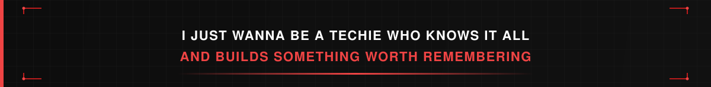

 

 

 

`AI SYSTEMS`&nbsp;&nbsp;·&nbsp;&nbsp;`SOFTWARE ENGINEERING`&nbsp;&nbsp;·&nbsp;&nbsp;`CYBERSECURITY`&nbsp;&nbsp;·&nbsp;&nbsp;`CLOUD`

<h2 align="center">01 ABOUT ME</h2>

I'm a third-year Computer Engineering student and AI/ML + Full-Stack Developer focused on building intelligent systems from the model layer all the way to the application and infrastructure layer.

My work sits around **Artificial Intelligence · Agentic AI · Computer Vision · LLMs · Full-Stack Engineering · Cybersecurity · Cloud**.

I enjoy building systems where AI doesn't just generate an answer - it can reason, use tools, execute actions, inspect results, and adapt.

Currently exploring the intersection of **CLOUD COMPUTING x CYBERSECURITY**

<h2 align="center">02 FEATURED PROJECTS</h2>

<table>
<tr>
<td width="50%" valign="top">

### 🤖 Immortality
**Local-first Agentic AI**

A personal AI system designed to understand requests, reason through tasks, use tools, work with files, write and execute code, browse the web, and operate systems.

Architecture focus: task routing · planning & execution · tool use · memory / RAG · verification · reflection · multimodal capabilities · local inference

[→ Repository](https://github.com/reyansh7/Immortility)

</td>
<td width="50%" valign="top">

### 🛡️ Mirage
**AI-Powered Cyber Deception**

A Docker-based cyber-deception platform designed to create realistic decoy environments, observe attacker behavior, and provide real-time threat intelligence.

Focus areas: deceptive infrastructure · attacker interaction · behavioral analysis · isolated environments · security experimentation

[→ Repository](https://github.com/reyansh7/Mirage)

</td>
</tr>
<tr>
<td width="50%" valign="top">

### 👁️ Inventory Verification
**Computer Vision for Warehouse Auditing**

A full-stack computer vision system trained on **15,000+ images** for detecting and counting warehouse inventory.

The YOLO11L pipeline reached **83.2% Precision · 86.0% Recall · 86.8% mAP@50**, from an early baseline of roughly 42%.

[→ Repository](https://github.com/reyansh7/InventoryVerification)

</td>
<td width="50%" valign="top">

### ⚡ AlgoVerse
**Interactive Algorithm Execution Engine**

A visualization system that turns algorithm execution into synchronized traces, allowing users to inspect code execution, variables, data structures, timeline, and step-by-step state changes.

[→ Repository](https://github.com/reyansh7/AlgoVerse)

</td>
</tr>
<tr>
<td width="50%" valign="top">

### 🧠 SkillLens
**AI Recruitment Platform**

AI-powered recruitment tooling for analyzing resumes, matching candidates to skills, ranking applicants, comparing profiles, and generating interview questions.

[→ Repository](https://github.com/reyansh7/SkillLens)

</td>
<td width="50%" valign="top">

### 📄 Resume Analyzer
**AI Resume Intelligence**

Full-stack application for extracting information from resumes, analyzing skills, and matching candidates against relevant roles.

[→ Repository](https://github.com/reyansh7/Resume_Analyzer)

</td>
</tr>
</table>

<h2 align="center">03 TECHNICAL ARSENAL</h2>

## Languages

 

## AI / ML & Data Science

 

## Web & Backend

 

## Databases

 

## DevOps, Cloud & Tools

<h2 align="center">04 PROBLEM SOLVING</h2>

### 380+
**LeetCode Problems Solved**

 

<h2 align="center">05 GITHUB ACTIVITY</h2>

  

  

<picture>
  <source media="(prefers-color-scheme: dark)" srcset="./assets/github-contribution-grid-snake-dark.svg" />
  <source media="(prefers-color-scheme: light)" srcset="./assets/github-contribution-grid-snake.svg" />
  
</picture>

<h2 align="center">06 CONNECT</h2>

  

 

